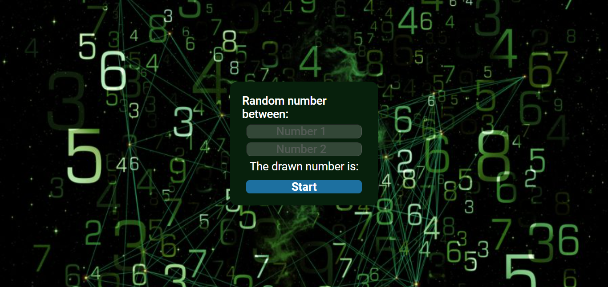

<h1>Randon em JavaScript</h1>

Mais um projeto  
Hoje gostaria de compartilhar com vocês um projeto que desenvolvi com a ajuda do curso DevClub. Trata-se de um gerador de números aleatórios interativo usando JavaScript. 
O objetivo deste projeto é criar um gerador de números aleatórios que permita ao usuário definir o intervalo de números a serem gerados.  
Este projeto foi uma ótima maneira de aprender sobre como gerar números aleatórios em JavaScript. Também foi uma boa oportunidade para praticar minhas habilidades de programação.

>Randon: https://daliosy.github.io/random/

<h2>Habilidades recentes:</h2>

Aprendi operações aritimeticas, Math, ciel, floor e randon no JavaScript.

<h2>Contato:</h2>

> Linkedin: https://www.linkedin.com/in/dalio-s-yamada/

> Github: https://github.com/DalioSY/randon

#HTML #CSS #JavaScript #Programação  #Dev #Desenvolvedor-Web #DesenvolvedorFrontEnd #DesenvolvedorFullStack #TransiçãoDeCarreira #Oportunidades #DisponívelParaTrabalho

